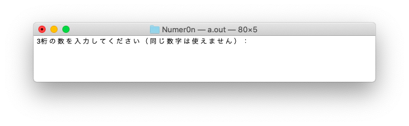
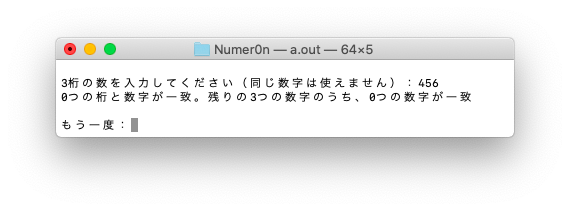
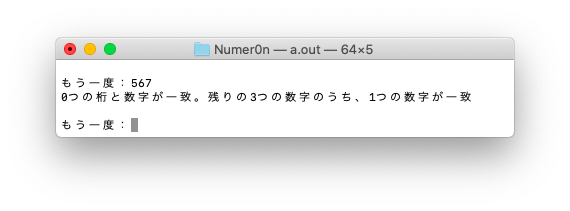
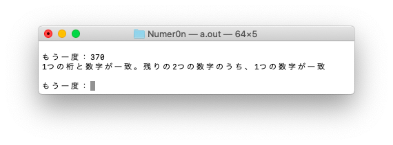
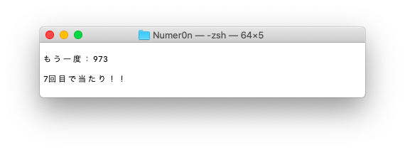
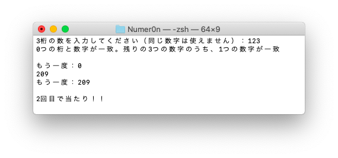

# Numer0n vs CPU
Numer0n vs CPUはフジテレビ系列の番組、「Numer0n」で行われていたゲームの簡易版をコンソール上で行えるアプリケーションです。

使用言語：C言語

# ゲームの始め方
本アプリケーションはC言語で書かれているので、通常のやり方でコンパイルしていただき、生成された実行ファイルを実行させてください。

例：gccの場合
```
gcc numeron.c
./a.out
```
# ルール
ゲームの勝利条件はアプリケーションが生成した答えの数字を推理し、当てることです。

答えの条件は以下のとおりです。
- ３桁の数字である。
- 先頭に0は来ない。
- 同じ数字は含まれない

数字を当てると言っても無作為に当てるのではなく、
数字を答えた時にもらえるヒントをもとに推理していきます。
もらえるヒントは以下の２つです。
1. 桁と数字の両方が一致している数(0~2)
2. 数字が一致している数(0~3)

答え「123」に対し、回答「142」の場合、
百の位の「1」が桁と数字の両方で一致しているので、
ヒント１の数は「1」となります。
また桁は違いますが数字「2」が答えにあるので
ヒント2の数は「1」となります。

この２つのヒントから推理して、少しずつ答えに近づいていきます。

# 遊び方

ゲームを始めると以下のように表示されます。



ここからゲームを進めていきます。

今回の答えは「973」です。
___
1回目に「456」と入力します。



今回は、答えと回答に同じ数字が含まれないので、ヒント１、ヒント２共に「０」となります。
___
続いて「123」と入力します。


今回は、一の位の「3」が桁も数字も一致しているので、ヒント１が「１」、ヒント２が「０」となります。
___
続いて「567」と入力します。



今回は、「7」が答えに含まれていますが桁が一致していないので、ヒント1が「0」、ヒント２が「1」となります。
___
続いて「370」と入力します。



今回は、十の位の「7」が桁も数字も一致しているので、ヒント１が「１」、
「3」が桁は一致せず、答えには含まれているので、ヒント２が「1」となります。
___
最後に答えである「973」を入力します。



答えを当てると、答えに到達するまでにかかった回答回数を表示します。
___
もし、どうしても答えがわからない場合は、
「0」を入力すると答えが表示されます。


